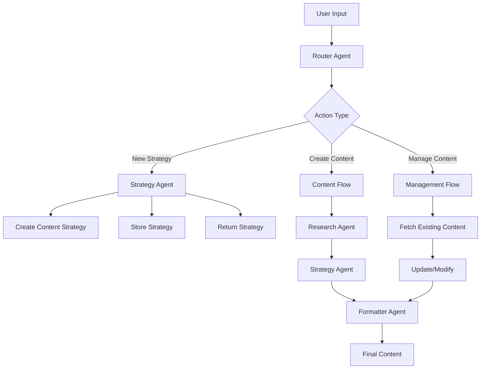

# Content Management System Design

## Overview
This document outlines the design of a multi-agent content management system that helps users create, manage, and format content for different platforms.

## System Components

### 1. Core Agents
- Router Agent (Main entry point)
- Strategy Agent (Content strategy management)
- Research Agent (Content research)
- Formatter Agent (Platform-specific formatting)
- Publisher Agent (Platform-specific publishing)

## Flow Diagram



## Implementation Plan

### Phase 1: Structured Routing

1. **Router Types and Schema**
```typescript
import { z } from 'zod';
import { generateObject } from 'ai';

// Define the routing schema
const RouterSchema = z.object({
  action: z.enum(['create_strategy', 'create_content', 'manage_content']),
  platform: z.enum(['linkedin', 'twitter', 'blog']),
  contentType: z.enum(['post', 'article', 'thread']),
  context: z.object({
    topic: z.string().optional(),
    existingStrategyId: z.string().optional(),
    contentId: z.string().optional(),
    requirements: z.array(z.string()).optional()
  })
});

type RouterOutput = z.infer<typeof RouterSchema>;
```

2. **Router Agent Implementation**
```typescript
const ROUTER_PROMPT = `You are a content management router that analyzes user requests and determines the appropriate action path.

Your task is to:
1. Analyze the user's request
2. Extract key information
3. Determine the correct action path
4. Provide structured output for routing

Guidelines:
- For content creation, ensure topic is captured
- For strategy management, check if existing strategy is referenced
- For content management, identify content IDs if provided
- Default to 'post' type if not specified
- Extract any specific requirements mentioned`;

export async function createContentRouter(userInput: string) {
  const agent = createAgent({
    name: 'content-router',
    langfuse: new Langfuse({
      publicKey: process.env.LANGFUSE_PUBLIC_KEY,
      secretKey: process.env.LANGFUSE_SECRET_KEY
    })
  });

  // Use generateObject for structured routing
  const routingDecision = await generateObject({
    model: getModel('openai:gpt-4o-mini'),
    schema: RouterSchema,
    system: ROUTER_PROMPT,
    prompt: userInput,
    tools: {
      checkExistingStrategy: strategyTool,
      validateContentId: validateTool
    },
    maxSteps: 2
  });

  return routingDecision;
}
```

3. **Usage Example**
```typescript
// Example 1: Content Creation Request
const result1 = await createContentRouter(
  "I need to create a LinkedIn post about AI development trends"
);
// Returns:
// {
//   action: "create_content",
//   platform: "linkedin",
//   contentType: "post",
//   context: {
//     topic: "AI development trends"
//   }
// }

// Example 2: Strategy Management
const result2 = await createContentRouter(
  "Update our Twitter thread strategy for tech news (strategy-id: abc123)"
);
// Returns:
// {
//   action: "create_strategy",
//   platform: "twitter",
//   contentType: "thread",
//   context: {
//     existingStrategyId: "abc123",
//     topic: "tech news"
//   }
// }
```

### Phase 2: Content Strategy Schema

1. **Strategy Types**
```typescript
const ContentStrategySchema = z.object({
  platform: z.enum(['linkedin', 'twitter', 'blog']),
  contentType: z.enum(['post', 'article', 'thread']),
  tone: z.enum(['professional', 'casual', 'technical', 'engaging']),
  structure: z.object({
    sections: z.array(z.string()),
    wordCount: z.number(),
    format: z.string()
  }),
  guidelines: z.array(z.string()),
  keywords: z.array(z.string()),
  engagement: z.object({
    callToAction: z.string(),
    targetAudience: z.string(),
    hashtagStrategy: z.string().optional()
  })
});

export async function createStrategyAgent(topic: string, platform: string) {
  // Use generateObject for structured strategy creation
  const strategy = await generateObject({
    model: getModel('openai:gpt-4o-mini'),
    schema: ContentStrategySchema,
    system: STRATEGY_PROMPT,
    prompt: `Create a content strategy for ${platform} about ${topic}`,
    tools: {
      research: researchTool,
      analyzeAudience: audienceTool
    },
    maxSteps: 3
  });

  return strategy;
}
```

### Phase 3: Content Formatter Schema

```typescript
const ContentFormatSchema = z.object({
  content: z.string(),
  metadata: z.object({
    platform: z.enum(['linkedin', 'twitter', 'blog']),
    type: z.enum(['post', 'article', 'thread']),
    wordCount: z.number(),
    readingTime: z.number()
  }),
  structure: z.object({
    sections: z.array(z.object({
      type: z.enum(['opening', 'body', 'closing']),
      content: z.string()
    })),
    formatting: z.object({
      paragraphs: z.array(z.string()),
      bullets: z.array(z.string()).optional(),
      emphasis: z.array(z.string()).optional()
    })
  }),
  seo: z.object({
    keywords: z.array(z.string()),
    hashtags: z.array(z.string()).optional()
  })
});

export async function createFormatterAgent(
  strategy: z.infer<typeof ContentStrategySchema>,
  topic: string
) {
  const formattedContent = await generateObject({
    model: getModel('openai:gpt-4o-mini'),
    schema: ContentFormatSchema,
    system: FORMATTER_PROMPT,
    prompt: JSON.stringify({ strategy, topic }),
    tools: {
      research: researchTool,
      checkGuidelines: guidelinesTool
    },
    maxSteps: 3
  });

  return formattedContent;
}
```

## Usage Flow

```typescript
async function handleContentRequest(userInput: string) {
  // 1. Route the request
  const route = await createContentRouter(userInput);

  // 2. Based on routing, execute appropriate flow
  switch (route.action) {
    case 'create_content': {
      // Get or create strategy
      const strategy = route.context.existingStrategyId
        ? await fetchStrategy(route.context.existingStrategyId)
        : await createStrategyAgent(route.context.topic!, route.platform);

      // Format content
      const content = await createFormatterAgent(
        strategy,
        route.context.topic!
      );

      return content;
    }
    case 'create_strategy': {
      const strategy = await createStrategyAgent(
        route.context.topic!,
        route.platform
      );
      return strategy;
    }
    // ... handle other cases
  }
}
```

## Best Practices for Structured Generation

1. **Schema Design**
   - Define clear, comprehensive schemas
   - Use enums for fixed options
   - Include optional fields for flexibility
   - Nest objects for complex structures

2. **Prompting**
   - Provide clear instructions about structure
   - Include examples in system prompts
   - Specify validation requirements
   - Handle edge cases explicitly

3. **Error Handling**
   - Validate schema compliance
   - Provide fallback values
   - Log validation errors
   - Implement retry logic

4. **Performance**
   - Cache generated objects
   - Implement partial updates
   - Use appropriate maxSteps
   - Monitor generation time 