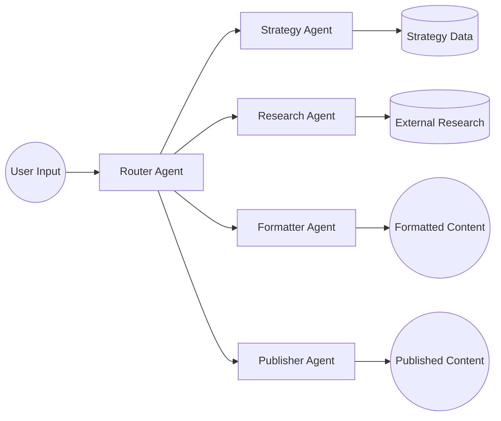
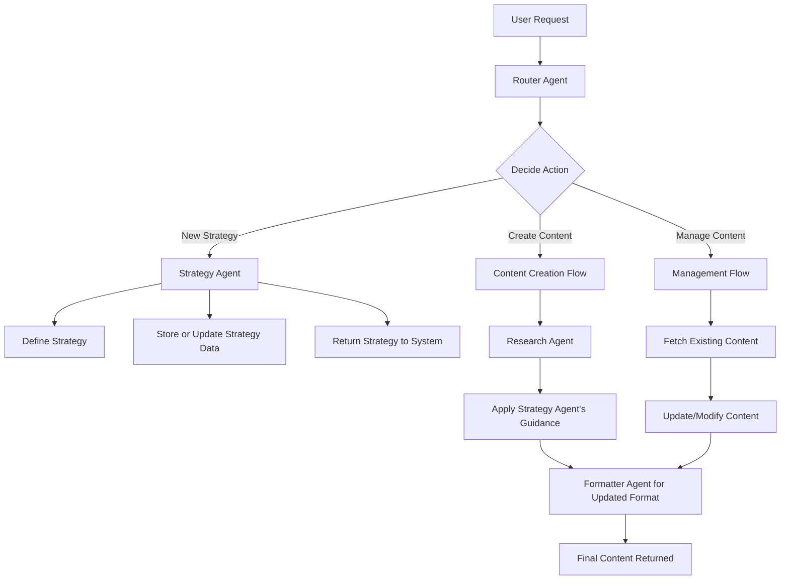
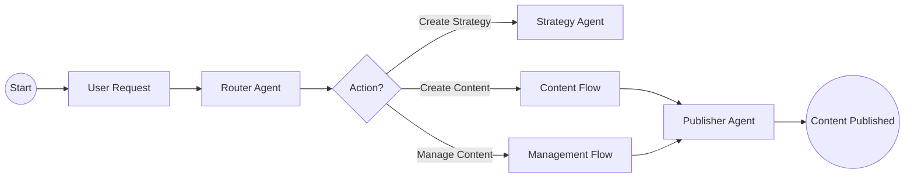
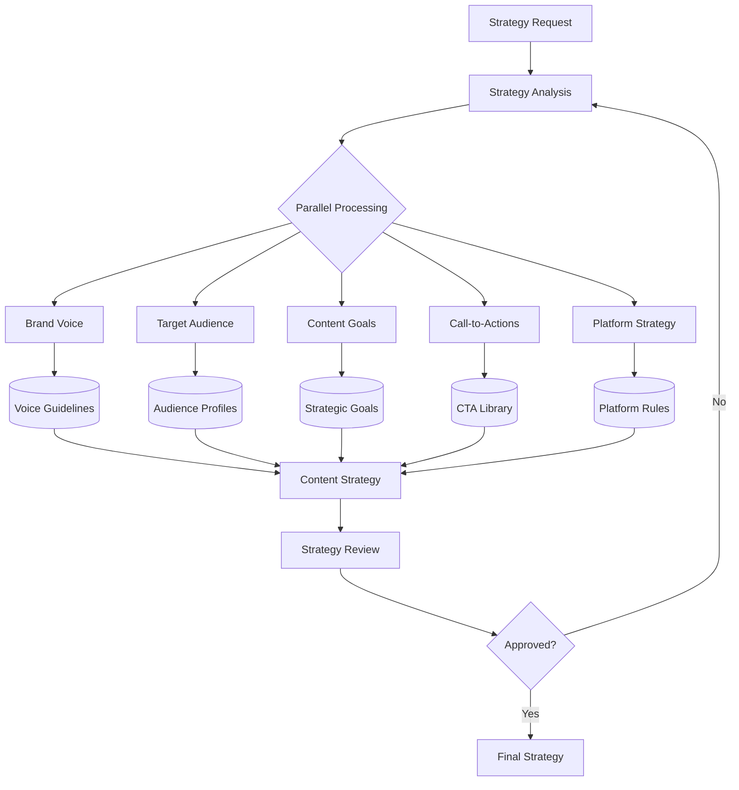
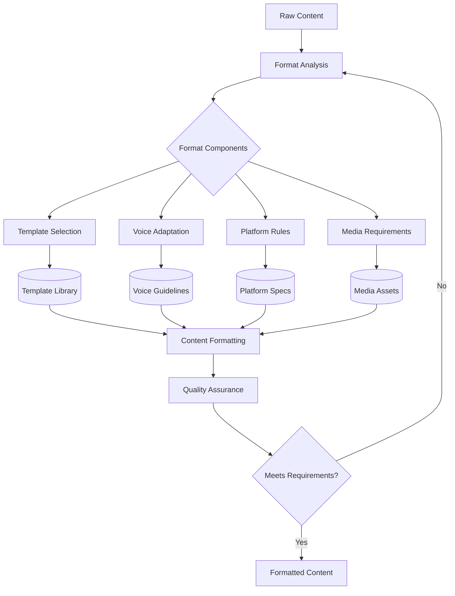

# Multi-Agent Content Creation System

This document provides a **high-level overview** of a multi-agent content creation system. It is intended for **executive-level** review (e.g., a CEO), focusing on **how** the system works and **why** it matters, rather than technical implementation details.

---

## 1. System Overview

The system is composed of **multiple specialized agents** that work together to create, manage, and publish content. Each agent performs a specific role to streamline the entire process from **user request** to **final publication**.

1. **User Input**: A user provides a request or idea for new content.  
2. **Router Agent**: Determines the **type of action** needed (e.g., create new content, update a strategy, manage existing content).  
3. **Strategy Agent**: Manages **content strategies** (tone, style, guidelines, etc.).  
4. **Research Agent**: Gathers **relevant data** from external sources to support content creation.  
5. **Formatter Agent**: Adapts the content to be **platform-specific** (LinkedIn, Twitter, blog, etc.).  
6. **Publisher Agent**: Publishes or schedules the **final** content on the chosen platform.

---

## 2. Content Creation Flow

Below is a more detailed diagram showing how new content moves through the system from **concept** to **final output**.

1. **Router Agent** decides whether the user wants to:  
   - Create a brand-new strategy.  
   - Draft fresh content using an existing or new strategy.  
   - Manage or update existing content.  
2. **Strategy Agent** either creates a new strategy or retrieves a stored one, ensuring **consistency** across all content pieces.  
3. **Research Agent** gathers **external data** (stats, references, keywords) to enrich the content.  
4. **Formatter Agent** refines the content to match **platform requirements** (character limits, tone, structure).  
5. In the **Management Flow**, existing content is fetched, modified, and re-formatted for republishing.

---

## 3. Roles of Each Agent

### 3.1 Router Agent
- **Primary Decision Maker**: Analyzes the user's request and routes it to the correct agent flow.  
- **Ensures Coordination**: Orchestrates interactions to avoid confusion and maintain smooth communication among agents.

### 3.2 Strategy Agent
- **Defines the Blueprint**: Establishes guidelines, tone, target audience, and structural requirements for content.  
- **Maintains Consistency**: Ensures new pieces of content align with the overarching content strategy.

### 3.3 Research Agent
- **Data Gathering**: Searches external sources to obtain insights, facts, or industry statistics relevant to the topic.  
- **Continuous Improvement**: Keeps content current by integrating the latest information and trends.

### 3.4 Formatter Agent
- **Platform Adaptation**: Adjusts content elements (length, style, structure) to match platform-specific criteria (e.g., LinkedIn vs. Twitter).  
- **Quality Control**: Makes sure the final content is polished, coherent, and meets strategy guidelines.

### 3.5 Publisher Agent
- **Last Mile Delivery**: Publishes the formatted content to the desired platform(s).  
- **Scheduling**: Can optionally plan posting times to maximize engagement.

---

## 4. Key Benefits

1. **Efficiency**  
   - Streamlines the entire content creation process from user request to publishing.  
   - Automated decisions reduce back-and-forth and manual oversight.

2. **Consistency**  
   - Centralized strategy ensures that every piece of content follows the same brand voice and guidelines.  
   - Platform-specific formatting is handled uniformly.

3. **Scalability**  
   - New platforms or functionalities can be added by introducing or adjusting agents without overhauling the entire system.  
   - Easy to integrate with additional tools or data sources.

4. **Data-Driven**  
   - Research Agent's continuous data gathering ensures content remains relevant and up-to-date.  
   - Strategies can be refined based on performance insights.

---

## 5. High-Level Process Recap

**Simple Explanation**:
1. **User** makes a request (e.g., "create a LinkedIn post").  
2. **Router Agent** figures out whether to create a strategy, create new content, or manage existing content.  
3. **Research** and **Strategy** are applied to shape the final piece.  
4. The content is **formatted** and finally **published** on the chosen platform.  

---

## 6. Conclusion

The multi-agent content creation system offers a **clear, efficient** path for turning **ideas** into **published content** across various platforms. By **segmenting responsibilities** into specialized agents—**Routing**, **Strategy**, **Research**, **Formatting**, and **Publishing**—the system becomes:

- **Easier to manage** and **scale**  
- **Consistent** in delivering high-quality output  
- **Adaptable** to new platforms, new content types, and evolving brand strategies  

For a CEO or decision-maker, the **value** lies in **automating** complex content production workflows while preserving **brand consistency** and **quality** across all communication channels.

---

## 7. Detailed Agent Workflows

### 7.1 Strategy Agent Deep Dive

The Strategy Agent is responsible for defining and maintaining content strategy across all platforms. It processes multiple inputs to create a comprehensive content strategy.

Key Components:
- **Brand Voice**: Tone, language style, and personality  
- **Target Audience**: Demographics, preferences, and behaviors  
- **Content Goals**: Engagement, conversion, awareness objectives  
- **CTAs**: Library of effective calls-to-action  
- **Platform Strategy**: Platform-specific requirements and best practices

### 7.2 Formatter Agent Deep Dive

The Formatter Agent transforms raw content into platform-optimized formats while maintaining brand consistency.

Key Processes:
- **Template Selection**: Choose appropriate template based on content type  
- **Voice Adaptation**: Adjust tone for the platform while maintaining brand voice  
- **Platform Rules**: Apply platform-specific constraints (character limits, formatting)  
- **Media Requirements**: Optimize images, videos, and other media assets  
- **Quality Assurance**: Verify formatting meets all requirements